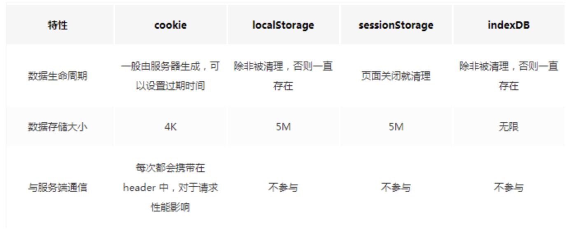

## Cookie

Cookie 的本职工作并非本地存储，而是“维持状态”。
因为HTTP协议是无状态的，HTTP协议自身不对请求和响应之间的通信状态进行保存，通俗来说，服务器不知道用户上一次做了什么，这严重阻碍了交互式Web应用程序的实现。
Cookie是网站为了辨别用户身份而储存在用户本地终端上的数据(通常经过加密)。 cookie是服务端生成，客户端进行维护和存储。

### Cookie原理
```
第一次访问网站的时候，浏览器发出请求，服务器响应请求后，会在响应头里面添加一个Set-Cookie选项，将cookie放入到响应请求中，在浏览器第二次发请求的时候，会通过Cookie请求头部将Cookie信息发送给服务器，服务端会辨别用户身份，另外，Cookie的过期时间、域、路径、有效期、适用站点都可以根据需要来指定。
```
### Cookie生成方式
```
生成方式一：http response header中的set-cookie
我们可以通过响应头里的 Set-Cookie 指定要存储的 Cookie 值。默认情况下，domain 被设置为设置 Cookie 页面的主机名。

生成方式二：js中可以通过document.cookie可以读写cookie，以键值对的形式展示。
如果服务端不想 Cookie 被客户端 JavaScript 脚本调用，那么可以设置 HttpOnly 标记。

tips:
Domain: 标识指定了哪些域名可以访问此Cookie。如果没有设置domain，就会自动绑定到执行语句的当前域。
如果设置为”.baidu.com”,则所有以”baidu.com”结尾的域名都可以访问该Cookie，所以在其他网页中无法通过js代码读取Cookie值。
```
### Cookie缺点
1. Cookie 不够大
```
Cookie的大小限制在4KB左右，对于复杂的存储需求来说是不够用的。当 Cookie 超过 4KB 时，它将面临被裁切的命运。这样看来，Cookie 只能用来存取少量的信息。此外很多浏览器对一个站点的cookie个数也是有限制的。

这里需注意：各浏览器的cookie每一个name=value的value值大概在4k，所以4k并不是一个域名下所有的cookie共享的,而是一个name的大小。
```

2. 过多的 Cookie 会带来巨大的性能浪费
```
Cookie 是紧跟域名的。同一个域名下的所有请求，都会携带 Cookie。大家试想，如果我们此刻仅仅是请求一张图片或者一个 CSS 文件，我们也要携带一个 Cookie 跑来跑去（关键是 Cookie 里存储的信息并不需要），这是一件多么劳民伤财的事情。Cookie 虽然小，请求却可以有很多，随着请求的叠加，这样的不必要的 Cookie 带来的开销将是无法想象的。

cookie是用来维护用户信息的，而域名(domain)下所有请求都会携带cookie，但对于静态文件的请求，携带cookie信息根本没有用，此时可以通过cdn（存储静态文件的）的域名和主站的域名分开来解决。
```
3. Cookie是明文传递
```
由于在HTTP请求中的Cookie是明文传递的，所以安全性成问题，除非用HTTPS。
```
  
为了弥补 Cookie 的局限性，让“专业的人做专业的事情”，Web Storage 出现了。  
HTML5中新增了本地存储的解决方案--Web Storage，它分成两类：sessionStorage和localStorage。  
这样有了WebStorage后，cookie能只做它应该做的事情了——作为客户端与服务器交互的通道，保持客户端状态。  
  
## localStorage
### localSttorage特点
```
1.保存的数据长期存在，下一次访问该网站的时候，网页可以直接读取以前保存的数据。
2.大小为5M左右
3.仅在客户端使用，不和服务端进行通信
4.接口封装较好

基于上面的特点，LocalStorage可以作为浏览器本地缓存方案。
```
### localSttorage存入/读取数据
```
localStorage保存的数据，以“键值对”的形式存在。也就是说，每一项数据都有一个键名和对应的值。所有的数据都是以文本格式保存。
存入数据使用setItem方法。它接受两个参数，第一个是键名，第二个是保存的数据。
localStorage.setItem("key","value");
读取数据使用getItem方法。它只有一个参数，就是键名。
var valueLocal = localStorage.getItem("key");
```
## sessionStorage
### sessionStorage特点
```
sessionStorage保存的数据用于浏览器的一次会话，当会话结束（通常是该窗口关闭），数据被清空；
sessionStorage 特别的一点在于，即便是相同域名下的两个页面，只要它们不在同一个浏览器窗口中打开，那么它们的 sessionStorage 内容便无法共享；
localStorage 在所有同源窗口中都是共享的；
cookie也是在所有同源窗口中都是共享的；
除了保存期限的长短不同，SessionStorage的属性和方法与LocalStorage完全一样。
```
### sessionStorage使用场景
```
sessionStorage 更适合用来存储生命周期和它同步的会话级别的信息。比如微博的 sessionStorage 就主要是存储你本次会话的浏览足迹
```

## localStorage与sessionStorage异同

### 相同点
```
都是保存在浏览器端，且都遵循同源策略
```
### 不同点
1. 作用域
```
localStorage只要在相同的协议、相同的主机名、相同的端口下，就能读取/修改到同一份localStorage数据。
sessionStorage比localStorage更严苛一点，除了协议、主机名、端口外，还要求在同一窗口（也就是浏览器的标签页）下。
```
2. 生命周期
```
localStorage 是持久化的本地存储，存储在其中的数据是永远不会过期的，使其消失的唯一办法是手动删除；
而 sessionStorage 是临时性的本地存储，它是会话级别的存储，当会话结束（页面被关闭）时，存储内容也随之被释放。
```

Web Storage 只能存储字符串，要想得到对象，我们还需要先对字符串进行一轮解析。
说到底，Web Storage 是对 Cookie 的拓展，它只能用于存储少量的简单数据。当遇到大规模的、结构复杂的数据时，Web Storage 也爱莫能助了。这时候我们就要清楚我们的终极大 boss——IndexedDB！

## IndexedDB
IndexedDB 是一个运行在浏览器上的非关系型数据库。既然是数据库了，那就不是 5M、10M 这样小打小闹级别了。理论上来说，IndexedDB 是没有存储上限的（一般来说不会小于 250M）。它不仅可以存储字符串，还可以存储二进制数据。

### IndexedDB特点
- 键值对储存  
IndexedDB 内部采用对象仓库（object store）存放数据。所有类型的数据都可以直接存入，包括 JavaScript 对象。对象仓库中，数据以"键值对"的形式保存，每一个数据记录都有对应的主键，主键是独一无二的，不能有重复，否则会抛出一个错误。

- 异步  
IndexedDB 操作时不会锁死浏览器，用户依然可以进行其他操作，这与 LocalStorage 形成对比，后者的操作是同步的。异步设计是为了防止大量数据的读写，拖慢网页的表现。

- 支持事务  
IndexedDB 支持事务（transaction），这意味着一系列操作步骤之中，只要有一步失败，整个事务就都取消，数据库回滚到事务发生之前的状态，不存在只改写一部分数据的情况。

- 同源限制  
IndexedDB 受到同源限制，每一个数据库对应创建它的域名。网页只能访问自身域名下的数据库，而不能访问跨域的数据库。

- 储存空间大  
IndexedDB 的储存空间比 LocalStorage 大得多，一般来说不少于 250MB，甚至没有上限。

- 支持二进制储存  
IndexedDB 不仅可以储存字符串，还可以储存二进制数据（ArrayBuffer 对象和 Blob 对象）。



## 总结
- Cookie 的本职工作并非本地存储，而是“维持状态”
- Web Storage 是 HTML5 专门为浏览器存储而提供的数据存储机制，不与服务端发生通信
- IndexedDB 用于客户端存储大量结构化数据