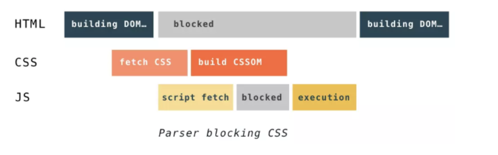
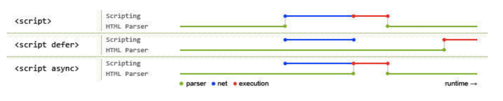

## 前言

浏览器的内核是指支持浏览器运行的最核心的程序，分为两个部分的，一是渲染引擎，另一个是JS引擎。渲染引擎在不同的浏览器中也不是都相同的。目前市面上常见的浏览器内核可以分为这四种：Trident（IE）、Gecko（火狐）、Blink（Chrome、Opera）、Webkit（Safari）。这里面大家最耳熟能详的可能就是 Webkit 内核了，Webkit 内核是当下浏览器世界真正的霸主。


## 页面加载过程

在介绍浏览器渲染过程之前，我们简单介绍下页面的加载过程，有助于更好理解后续渲染过程。  

要点如下：  
1. 浏览器根据 DNS 服务器得到域名的 IP 地址
2. 向这个 IP 的机器发送 HTTP 请求
3. 服务器收到、处理并返回 HTTP 请求
4. 浏览器得到返回内容
例如在浏览器输入https://www.baidu.com，然后经过 DNS 解析，对应的 IP 是36.248.217.149（不同时间、地点对应的 IP 可能会不同）。然后浏览器向该 IP 发送 HTTP 请求。  

服务端接收到 HTTP 请求，然后经过计算（向不同的用户推送不同的内容），返回 HTTP 请求  

其实就是一堆 HMTL 格式的字符串，因为只有 HTML 格式浏览器才能正确解析，这是 W3C 标准的要求。接下来就是浏览器的渲染过程。

## 浏览器渲染过程
浏览器渲染过程大体分为如下三部分：  
1. 浏览器会解析三个东西 
- HTML  
HTML字符串描述了一个页面的结构，浏览器会把HTML结构字符串解析转换DOM树形结构。
- CSS  
解析CSS会产生CSS规则树，它和DOM结构比较像。
- Javascript脚本  
等到Javascript 脚本文件加载后， 通过 DOM API 和 CSSOM API 来操作 DOM Tree 和 CSS Rule Tree。
2. 解析完成后，浏览器引擎会通过DOM Tree 和 CSS Rule Tree 来构造 Rendering Tree。
- Rendering Tree 渲染树并不等同于DOM树，渲染树只会包括需要显示的节点和这些节点的样式信息。
- CSS 的 Rule Tree主要是为了完成匹配并把CSS Rule附加上Rendering Tree上的每个Element（也就是每个Frame）。
- 然后，计算每个Frame 的位置，这又叫layout和reflow过程。
3. 最后通过调用操作系统Native GUI的API绘制。

接下来我们针对这其中所经历的重要步骤详细阐述  

### 构建DOM

### 构建CSSOM

### 构建渲染树

## 总结
```
浏览器会先下载和构建CSSOM，然后再执行JavaScript，最后在继续构建DOM。
时序图如下：
```


## tips
### async和defer的作用是什么？有什么区别?
接下来我们对比下 defer 和 async 属性的区别：  

  

其中蓝色线代表JavaScript加载；红色线代表JavaScript执行；绿色线代表 HTML 解析。  

1. 情况1<script src="script.js"></script>  
没有 defer 或 async，浏览器会立即加载并执行指定的脚本，也就是说不等待后续载入的文档元素，读到就加载并执行。  

2. 情况2<script async src="script.js"></script> (异步下载)  
async 属性表示异步执行引入的 JavaScript，与 defer 的区别在于，如果已经加载好，就会开始执行——无论此刻是 HTML 解析阶段还是 DOMContentLoaded 触发之后。需要注意的是，这种方式加载的 JavaScript 依然会阻塞 load 事件。换句话说，async-script 可能在 DOMContentLoaded 触发之前或之后执行，但一定在 load 触发之前执行。

3. 情况3 <script defer src="script.js"></script>(延迟执行)  
defer 属性表示延迟执行引入的 JavaScript，即这段 JavaScript 加载时 HTML 并未停止解析，这两个过程是并行的。整个 document 解析完毕且 defer-script 也加载完成之后（这两件事情的顺序无关），会执行所有由 defer-script 加载的 JavaScript 代码，然后触发 DOMContentLoaded 事件。   

defer 与相比普通 script，有两点区别：载入 JavaScript 文件时不阻塞 HTML 的解析，执行阶段被放到 HTML 标签解析完成之后。
在加载多个JS脚本的时候，async是无顺序的加载，而defer是有顺序的加载。  

### 回流(Reflow)和重绘(Repaint)
- 重绘：当我们对 DOM 的修改导致了样式的变化、却并未影响其几何属性（比如修改了颜色或背景色）时，浏览器不需重新计算元素的几何属性、直接为该元素绘制新的样式（跳过了上图所示的回流环节）。
- 回流：当我们对 DOM 的修改引发了 DOM 几何尺寸的变化（比如修改元素的宽、高或隐藏元素等）时，浏览器需要重新计算元素的几何属性（其他元素的几何属性和位置也会因此受到影响），然后再将计算的结果绘制出来。这个过程就是回流（也叫重排）

```
回流必定会发生重绘，重绘不一定会引发回流。重绘和回流会在我们设置节点样式时频繁出现，同时也会很大程度上影响性能。回流所需的成本比重绘高的多，改变父节点里的子节点很可能会导致父节点的一系列回流。
```
