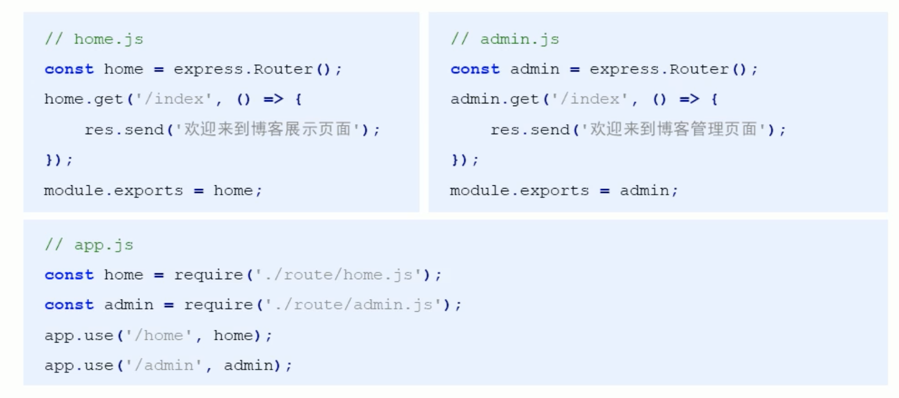
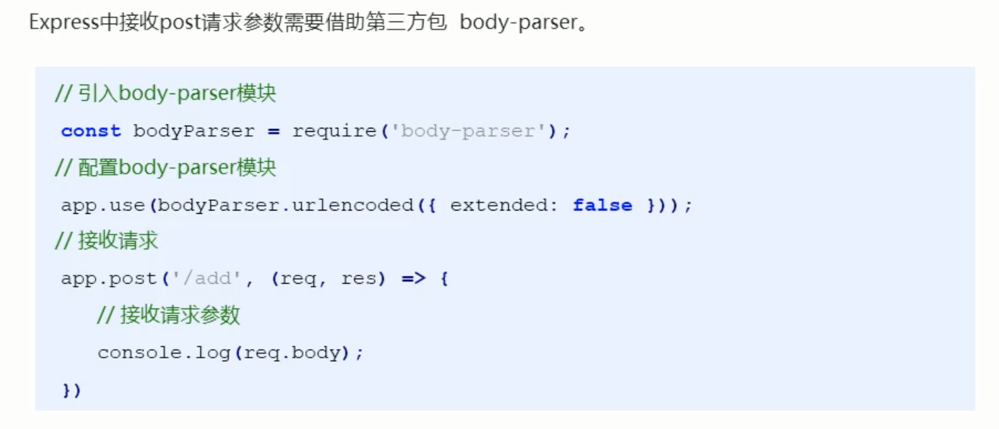
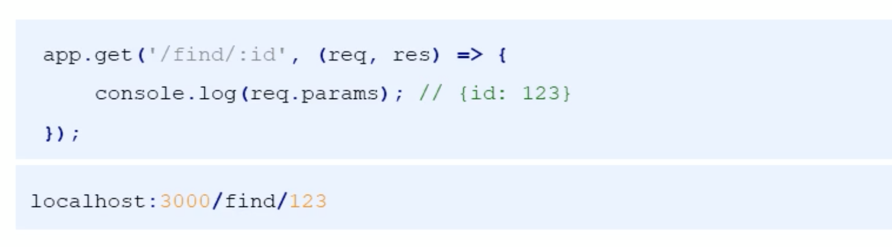
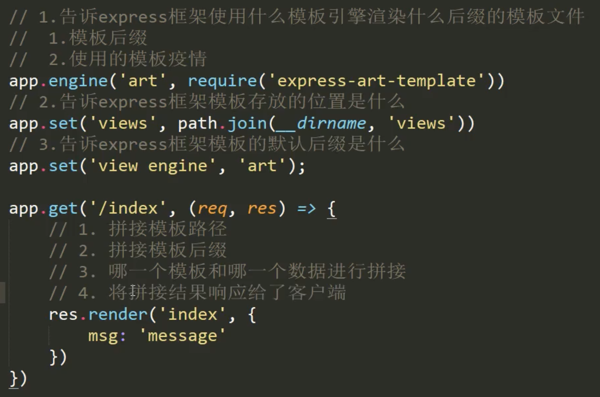
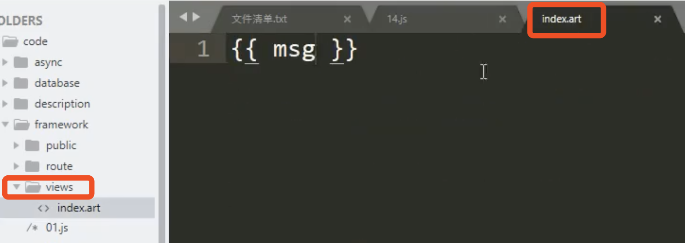

## 安装

```js
npm install express
```

## 特性

-   没有内置的模板引擎，但是对第三方的支持度较好
-   提供的中间件机制可以有效控制 HTTP 请求
-   拥有大量的第三方中间件对其功能进行扩展

## 基本使用

```js
const express = require('express');
const app = new express();

app.get('/', (req, res) => {
    // send 会自动设置Content-type 为 text/html
    res.send('hello');
});

app.get('/list', (req, res) => {
    // send 会自动设置Content-type 为 application/json
    res.send({ name: 'xx', age: 18 });
});

app.listen(3000);

console.log('server started');
```

## 中间件的基本使用

中间件使用的最初模型如下  
通过 next 函数交给下一个相同路由的处理函数

```js
app.get('/', (req, res, next) => {
    req.name = 'xuwei';
    next();
});

app.get('/', (req, res, next) => {
    res.send({ name: req.name, age: 18 });
});
```

## app.use 的使用

后面进行了改造，通过新增`app.use`方法，可以不用区分是 get 请求还是 post 请求，只要 url 匹配，就可以进行处理

```js
// 不指定处理的url，则可以拦截处理全部的请求
app.use((req, res, next) => {
    console.log('get request');
    next();
});

// 处理url以/list开头的请求，不区分get or post
app.use('/list', (req, res, next) => {
    console.log('get list request');
    next();
});
```

> 需要注意的是，请求到达时，依旧是按照文件从上往下的顺序匹配路由，所以不能将 app.use 写在 app.get 的下方，要不然 app.use 永远不会被触发。如下就是错误的使用

```js
app.get('/list', (req, res) => {
    res.send({ name: req.name, age: 18 });
});
// 因为该use写在get下方，所以并不会得到执行，浏览器得到的是{age: 18}
app.use('/list', (req, res, next) => {
    req.name = 'sss';
    next();
});
```

思考， 如果是以下的定义，服务器会返回什么呐？

```js
app.get('/list', (req, res) => {
    res.send({ name: req.name, age: 18 });
});
app.use('/', (req, res, next) => {
    req.name = 'sss';
    next();
});
```

依然是{age: 18}  
所以可以断定，express 单纯靠顺序来匹配，没有路径的优先级之说  
基于此，可以实现自定义 404

## 错误处理中间件

```js
app.use((err, req, res, next) => {
    res.status(500).send('server error');
});
```

## 构建模块化路由

```js
const express = require('express');
const title = express.Router();
app.use('/index', title);

title.get('/news', (req, res) => {
    res.send('hello');
});
title.get('/guest', (req, res) => {
    res.send({ name: 'xx', age: 18 });
});
```

/index/news 会返回 hello  
/index/guest 会返回 {name: 'xx', age: 18}



## GET 参数的获取


## POST 参数的获取



```
body-parse主要做了以下工作
1. 解析body体并转化为对象
2. 给req对象添加属性body,并赋值为上面获得的对象
3. 调用next函数
```

> 注意，bodyParser.urlencoded 函数返回值仍是一个函数，并且函数的入参为(res, req, next)

```js
function fn() {
    return function (req, res, next) {
        console.log('xxxx');
        next();
    };
}

app.use(fn());
```

## Restful 风格参数获取



## 静态资源访问


```
其实就是使用use拦截了所有的请求，然后使用 express.static 进行处理
发现如果是访问的静态资源，则直接返回给客户端结果。
如果不是请求静态资源，则调用 next 向下处理。

从图片中静态资源的url可以看出，我们不能直观的看出哪些请求是访问静态资源
所以我们可以进一步处理

app.use('/static', express.static(__dirname, 'public'));

基于此，所有url中携带staitc的请求都会经过该中间件处理
此时静态资源的链接就变为了

http://localhost:3000/static/css/style.ss
```

## 模板引擎




> 注意，其中 app.set 中第一个参数 `view` `view engine` 是硬编码的

## app.locals 对象

app.render 方法的第二个参数是要给模板传递的参数  
有这样一种情况，就是有某些公共数据，所有的页面渲染都要用到  
如果每次都通过 app.render 第二个参数进行传递，未免太麻烦了  
这时候就可以用到 app.locals 对象  
我们可以把公共数据挂载到 app.locals 对象下面,就像下面这样  
然后所有的模板就都可以访问到这个数据了，不需要显式的进行传递

```js
app.locals.users = [{ name: 'xxx' }, { name: 'eee' }];
```

index.art

```
{{users[0].name}}
```
