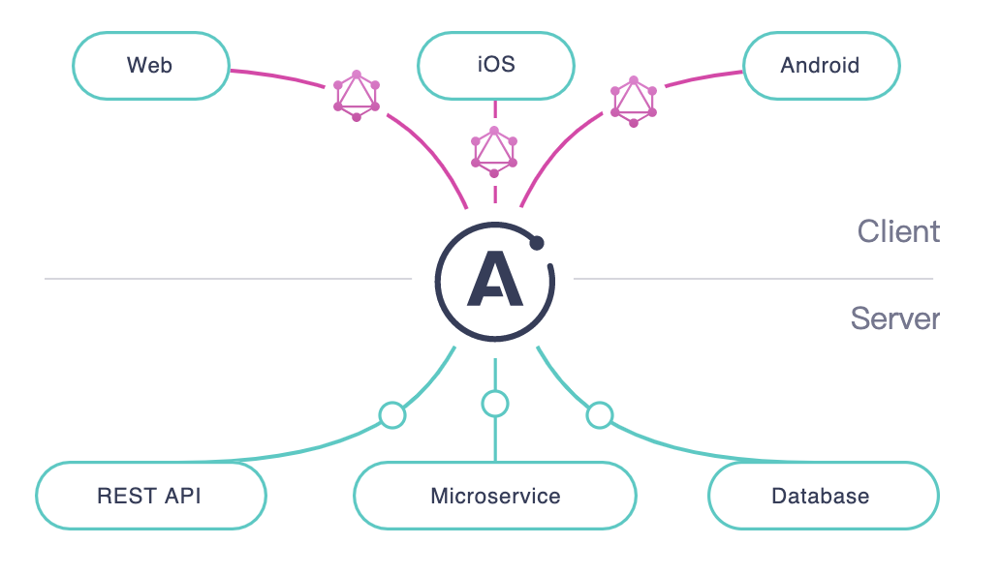

## 概念
Apollo提供了实现GraphQL规范的服务器及客户端的实现  
可以帮助我们更快捷方便的使用GraphQL



## Docs
server
> Introduction to Apollo Server - Apollo Server - Apollo GraphQL Docs
> https://www.apollographql.com/docs/apollo-server/

client
> https://www.apollographql.com/docs/react/

## 集成Express
虽然 apollo server 自带web服务，但是实际的生产中，apollo server多以中间件的形式嵌入到现有的node服务框架中  
推荐使用 apollo-server-express  
Integrating with Node.js middleware - Apollo Server - Apollo GraphQL Docs
https://www.apollographql.com/docs/apollo-server/integrations/middleware/

## Resolvers
> Resolvers - Apollo Server - Apollo GraphQL Docs
> https://www.apollographql.com/docs/apollo-server/data/resolvers/

Apollo Server 需要知道如何为模式中的每个字段填充数据，以便它可以响应对该数据的请求。  
为此，它使用解析器(resolvers)  

```js
const resolvers = {
  Query: {
    user(parent, args, context, info) {
      return users.find(user => user.id === args.id);
    }
  }
}
```
如上所示，解析器接受四个参数
> (parent, args, context, info).

### Resolver-parent参数
每当 Apollo Server 解析包含对象类型的字段时，它总是会解析该对象的一个​​或多个字段。  
这些子域可能也包含对象类型。对象字段模式可以继续到任意深度，从而创建所谓的解析器链。  
在解析器链中，parent参数用来保存上一次的结果  
给我的感觉，很像是express中间件的链式处理模式  

### Resolver-args参数
提供的所有 GraphQL 参数的对象。  
例如，在执行时query{ user(id: "4") }，args传递给user解析器的对象是{ "id": "4" }。  

### Resolver-context参数
每一个解析器(resolver)中都需要用到的通用数据，可以放在context中
```js
// 定义
// Constructor
const server = new ApolloServer({
  typeDefs,
  resolvers,
  // context是一个函数，接收参数req，为此次请求的对象
  // 这样，每个resolver都可以从context中获取authScop
  context: ({ req }) => ({
    authScope: getScope(req.headers.authorization)
  })
}));

// 使用
// Example resolver
(parent, args, context, info) => {
  if(context.authScope !== ADMIN) throw new AuthenticationError('not admin');
}
```

## RESTDataSource
> Data sources - Apollo Server - Apollo GraphQL Docs
> https://www.apollographql.com/docs/apollo-server/data/data-sources/#restdatasource-reference

GraphQL服务器如果需要从另一个REST API风格的服务器获取数据作为数据源，可以使用apollo-datasource-rest  

> 学完之后发现，这个dataSources其实和egg.js中的server功能是一样的，就是在业务逻辑与数据库操作之间添加一层适配层

我们在创建ApolloServer时声明`dataSources`  
之后我们就可以在解析器参数的`context`中解构出 dataSources 使用
```js
const server = new ApolloServer({
  typeDefs,
  resolvers,
  dataSources: () => {
    return {
      moviesAPI: new MoviesAPI(),
      personalizationAPI: new PersonalizationAPI(),
    };
  }
});

Query: {
    movie: async (_source, { id }, { dataSources }) => {
      return dataSources.moviesAPI.getMovie(id);
    },
    mostViewedMovies: async (_source, _args, { dataSources }) => {
      return dataSources.moviesAPI.getMostViewedMovies();
    },
    favorites: async (_source, _args, { dataSources }) => {
      return dataSources.personalizationAPI.getFavorites();
    },
  },
```
