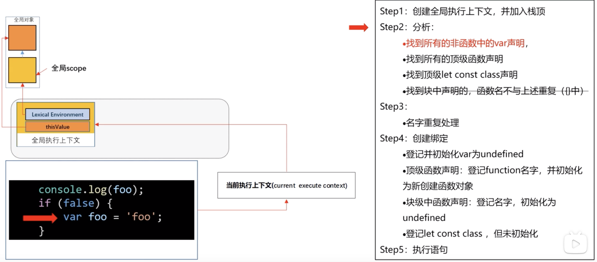
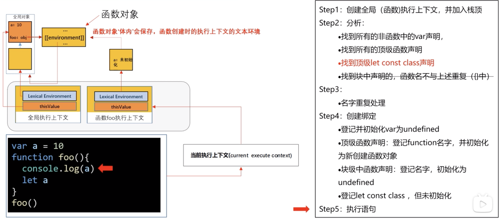
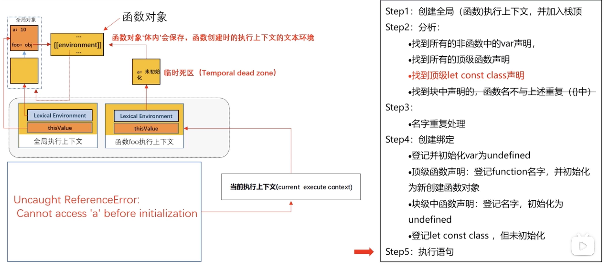
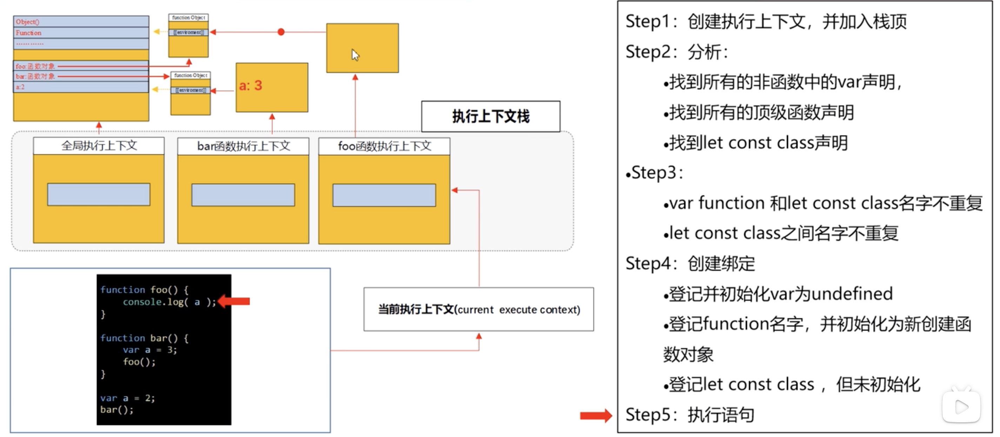
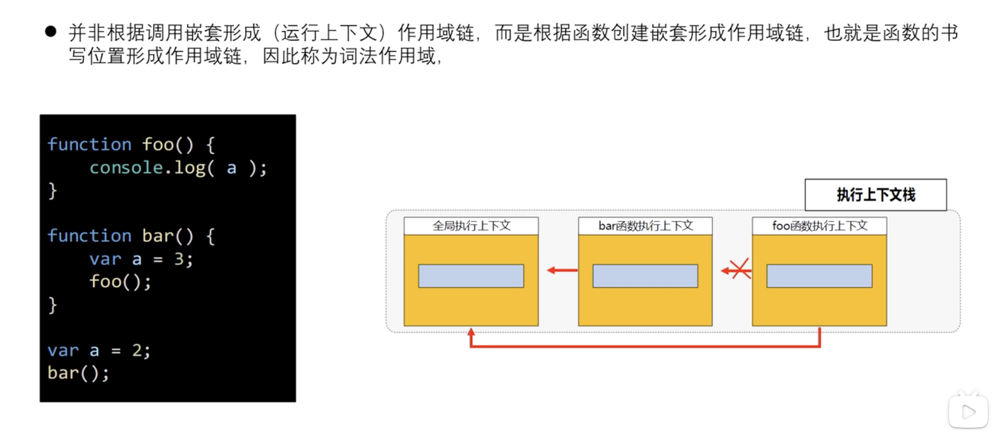

# 执行上下文

## 概念
```
javascript在执行语句前，经过一系列的准备，为代码执行创建一个环境 --- 执行上下文
```

## 4种情况会创建新的执行上下文
```
1. 进入全局代码之前
2. 执行function代码之前
3. 进入eval参数指定的代码
4. 进入module代码

重点前两种
```

## 执行栈
```
1. 执行栈栈顶的上下文称为当前执行上下文
2. js代码总是在当前执行上下文运行，即js代码需要用到的资源，到当前执行上下文查找。
```

`tips:`
```
1. var 和 function 声明创建在全局变量中
2. let const class 声明的变量创建在全局的scope中
3. 先到全局的scope中查找，找不到再到全局变量中查找
```







## 词法作用域





## 总结
```
js代码执行前要做一定的准备工作，就是创建执行上下文。
执行上下文包括：变量对象，作用域链指针以及this指针。

创建执行上下文的情况主要有两种，一个是执行全局js代码，一个是执行function函数。
拿执行全局js代码举例：
1. 首先会创建一个全局执行上下文，压入执行栈
2. 扫描所有的var和顶层function函数声明
3. 名称重复处理
4. 登记var名称，并初始化为undefined
5. 登记function名称，并初始化为新的函数对象
6. 执行js代码
```

## 参考资料
```
讲的是真不错
https://www.bilibili.com/video/BV1wD4y1D7Pp?from=search&seid=15480408670358849772
```