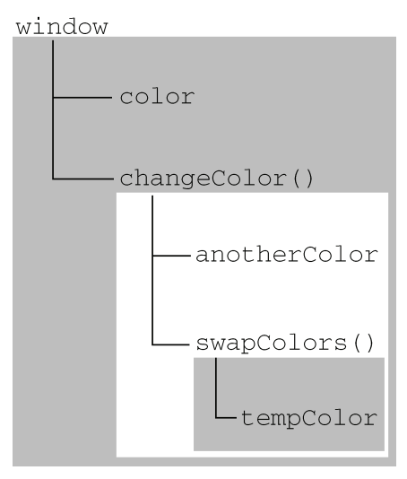

## 概念
```
闭包是指有权访问另一个函数作用域中的变量的函数。
怎能理解这句话呐，就是说：
当一个函数执行完毕后，里面的局部变量会被JS垃圾回收机制给销毁掉，从而释放内存。
但是如果返回一个函数，函数中用到了父级声明的变量，那么此时该变量不会被回收。
```

## 缺点
- 闭包会导致局部变量不被垃圾回收机制清理，增大内存消耗
- 在for循环使用var会出现循环绑定的问题， 使用let关键字可以解决该问题

## 优点
- 避免全局变量污染
- 模拟私有变量

## 应用
### 函数工厂
```js
我们写点击的回调函数比较多，通常会使用箭头函数给被调函数传参，
这种情况都可以改为闭包的写法

对比差异
function makeSizer(size) {
  document.body.style.fontSize = size + 'px';
}
document.getElementById('size-12').onclick = () => makeSize(12);
document.getElementById('size-14').onclick = () => makeSize(14);
document.getElementById('size-16').onclick = () => makeSize(16);

使用闭包
function makeSizer(size) {
  return function() {
    document.body.style.fontSize = size + 'px';
  };
}
document.getElementById('size-12').onclick = makeSizer(12);
document.getElementById('size-14').onclick = makeSizer(14);
document.getElementById('size-16').onclick = makeSizer(16);

```

### 模拟私有方法
```js
var makePerson = function(){
  var name;
  return {
    getName: function() {
      return name;
    },
    setName: function(newName) {
      name = newName;
    }
  }
};

var person = makePerson();
person.setName('xuwei');
person.getName(); // xuwei

其他方式无法访问name属性，起到了数据隐藏和封装的好处
```

## 原理
```
想要理解JavaScript中闭包的概念，首先我们先要了解JavaScript中的执行环境和作用域链。
```

### 执行环境
```
在JavaScript高级程序设计的4.2章有讲到：
执行环境是 JavaScript 中最为重要的一个概念。
每个执行环境都有一个与之关联的【变量对象】，执行环境中定义的所有变量和函数都保存在这个对象中。
虽然我们编写的代码无法访问这个对象，但解析器在处理数据时会在后台使用它。
```
### 作用域链
```
每个函数都有自己的执行环境，当函数在一个执行环境中执行时，会创建【变量对象】的作用域链。
作用域链的用途，是保证对执行环境有权访问的所有变量和函数的有序访问。
```

### 总结
```
总结来说，就是每个函数都有自己的执行环境，执行环境其实就是一个对象，其中定义了所能够访问到的所有变量和函数。
对象还定义了一个作用域链，用来确定这些变量和函数的访问顺序。
标识符解析的时候，会沿着作用域链向上一级一级的搜索。
```
```js
举例说明：
var color = "blue"; 
function changeColor(){ 
  var anotherColor = "red"; 
  function swapColors(){ 
    var tempColor = anotherColor; 
    anotherColor = color; 
    color = tempColor; 
    // 这里可以访问 color、anotherColor 和 tempColor 
  } 
  // 这里可以访问 color 和 anotherColor，但不能访问 tempColor 
  swapColors(); 
} 
// 这里只能访问 color 
changeColor();

以上代码共涉及 3 个执行环境：全局环境、changeColor()的局部环境和 swapColors()的局部环境。

全局环境中有一个变量 color 和一个函数 changeColor()。

changeColor()的局部环境中有一个名为 anotherColor 的变量和一个名为 swapColors()的函数，但它也可以访问全局环境中的变量 color。

swapColors()的局部环境中有一个变量 tempColor，该变量只能在这个环境中访问到。
无论全局环境还是 changeColor()的局部环境都无权访问 tempColor。然而，在 swapColors()内部
则可以访问其他两个环境中的所有变量，因为那两个环境是它的父执行环境。下图形象地展示了前面
这个例子的作用域链。
```


