## charles是什么
通过成为电脑或浏览器的代理，然后截取请求和请求的结果达到分析抓包的目的
> 免费版本，启动延迟十秒，使用半小时强制退出。收费版本没有这个问题

## 原理
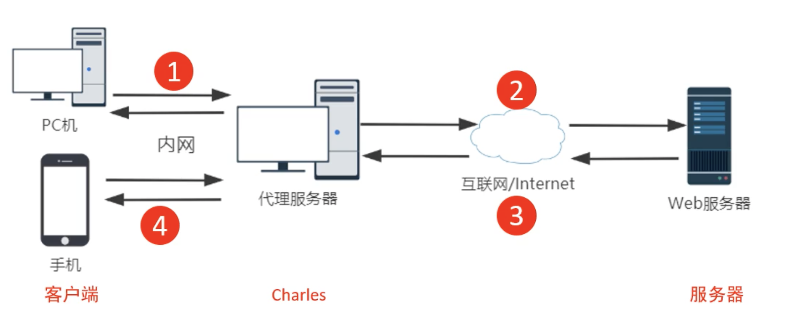

- 由客户端发送请求
- charles接收请求再发送给服务器
- 服务器返回结果给charles
- 由charles转发给客户端

基于上面的步骤，我们要配置两个地方
1. 代理服务器：运行charles，并配置代理
2. 客户端：配置代理

客户端的形式多种多样，可以是windows pc，macos pc, 手机


## 组件介绍
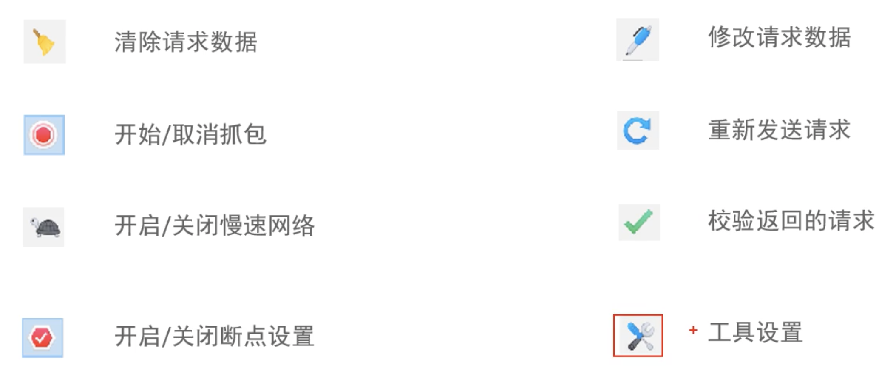

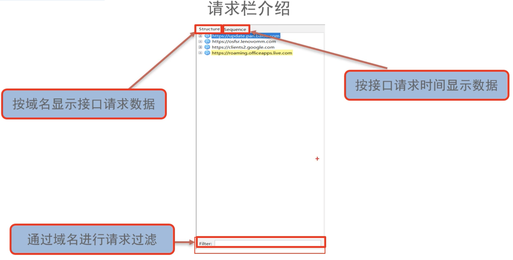

## 代理端口设置
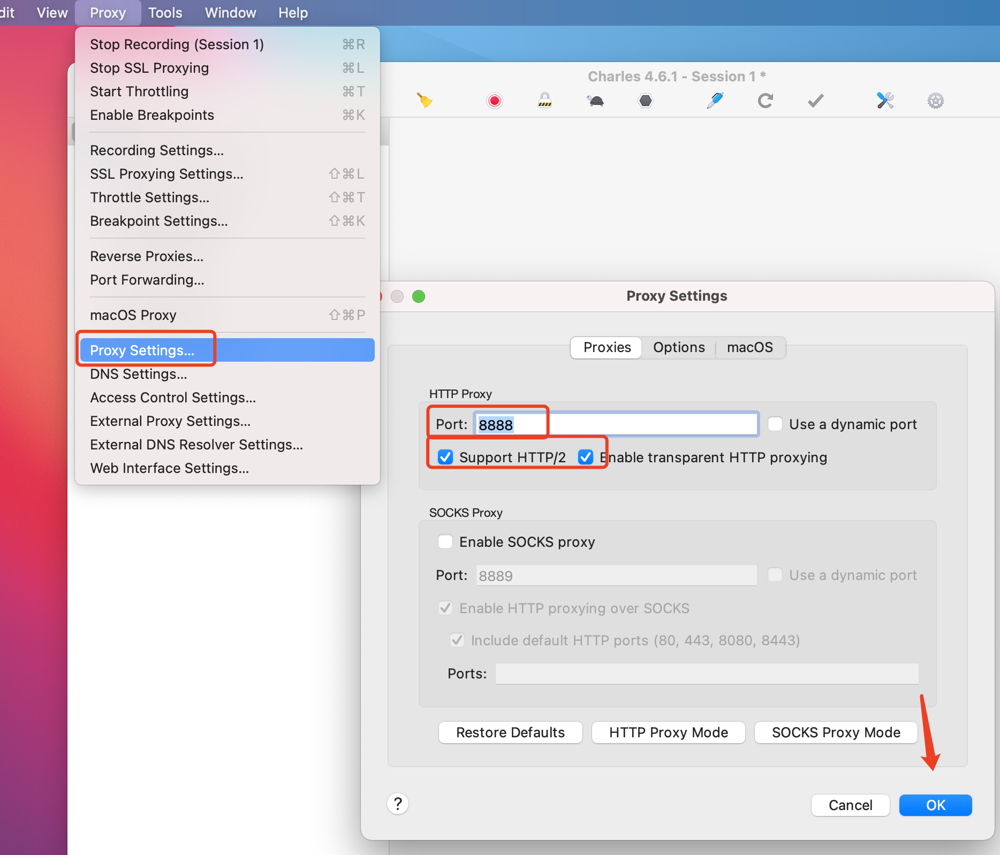

```
设置代理服务的端口，之后所有经过该端口的请求，都会被charles抓到
```
## 访问控制

```
具体含义可以看窗口的英文描述
```

> 经过上面两个步骤，代理服务器的ip和port就确定了  
> ip就是charles运行的本机地址，可通过如下方式查看
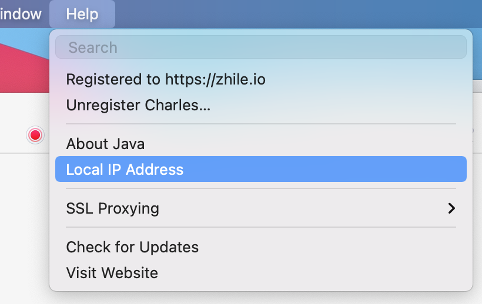
> 端口就是我们设置的8888  
> 之后在客户端设置代服务器地址时，就以上面两步设置的为准

## 客户端-MacOS PC设置代理

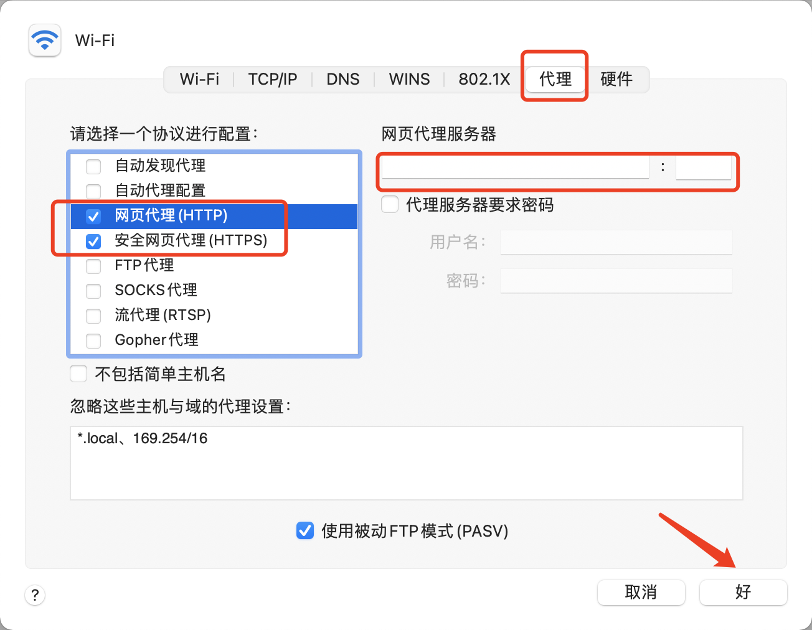
> 如果charles运行在本机，可快捷方式设置
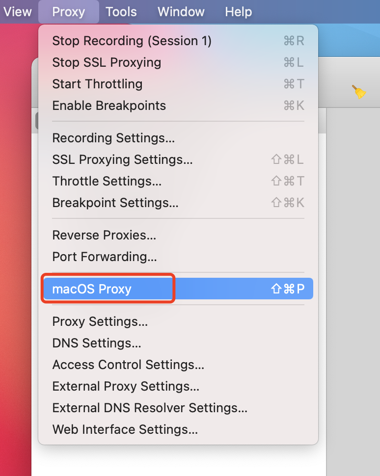
## 客户端-IOS iphone设置代理
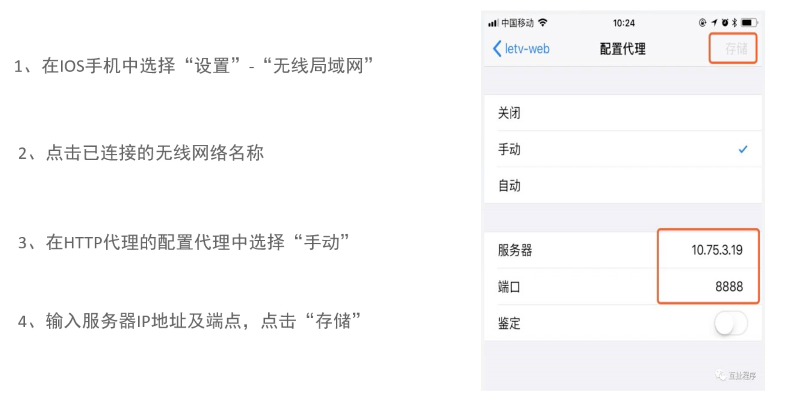


## https抓包
```
在配置之前，先说以下https的大致原理哈
我在之前的资料中也写到了，https之所以安全是因为在传输过程中使用了
非对称加密及对称加密。
非对称加密需要公钥和私钥。
```
1. charles设置https代理

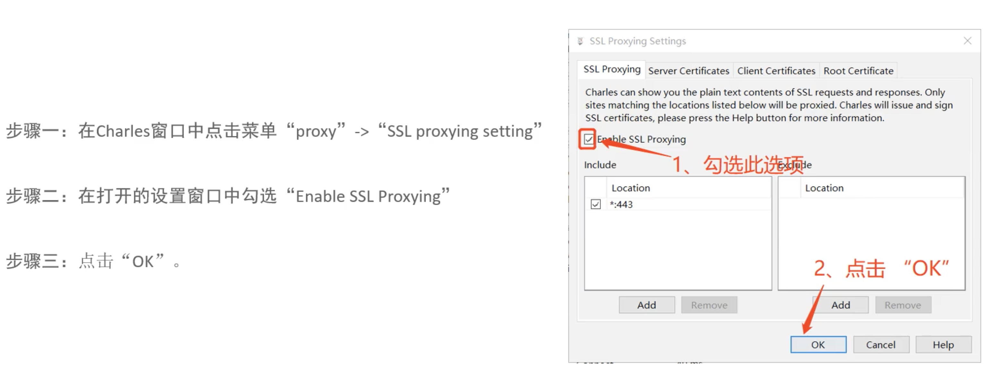

2. 客户端安装SSL证书  

客户端-MacOS安装SSL证书

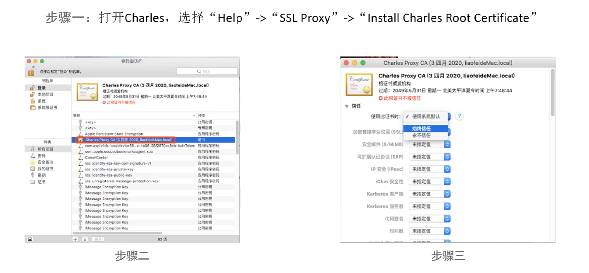

客户端-IOS安装SSL证书


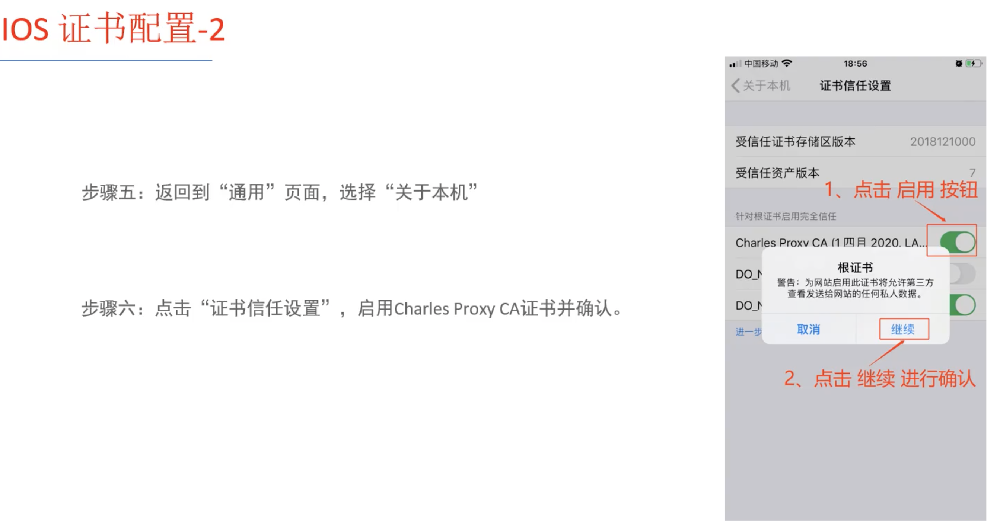

