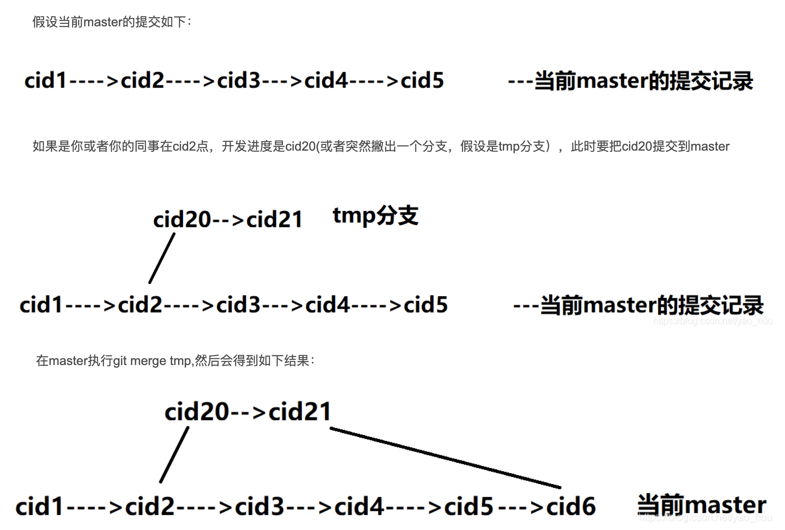
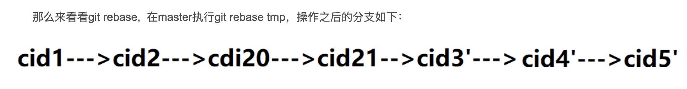
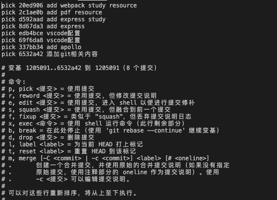

## 合并代码
除了`git pull` 更推荐使用 `git pull --rebase`

```
git pull          =  git fetch + git merge FETCH_HEAD 
git pull --rebase =  git fetch + git rebase FETCH_HEAD 
```



```
// rebase最新master分支
git pull --rebase origin master
如果出现冲突，解冲突-> git add . -> git rebase --continue -> git push -f
因为我们改变了commit的提交顺序，所以push到远程分支的时候，是会有冲突的，需要 -f 强推
```
---

## --amend
```
git commit -a --amend

-a 指所有的更改
--amend 将更改添加到最近一个提交中

效果: 可将当前修改添加到最后一次commit中，并且还能重新编辑commit信息
```
## rebase
```js
git rebase -i HEAD~3
git rebase -i 69f6da8dca9421eca19cd0daceecca433262917b

-i  表示用交互式方式打开
```

执行结果如上图，点击i可进行编辑，对每个commit进行操作。
其执行的大致逻辑为：
```
当我们保存退出编辑器的时候，git会将其从历史记录中删除列表中的所有这些提交
然后再重新依次执行每一行，根据我们对每一个提交指定的命令进行操作。
```

## 重置分支提交
```
// 将当前分支的HEAD重置为远端master分支的HEAD
git reset origin/master --hard
```
