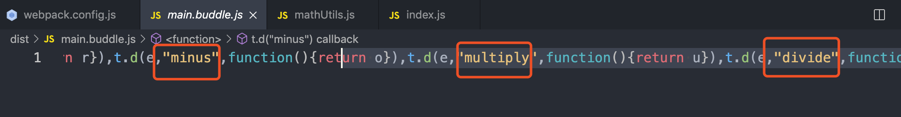
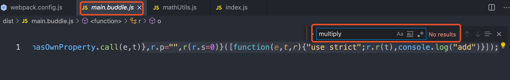
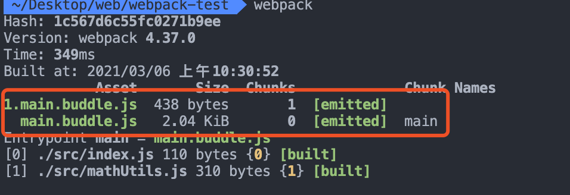
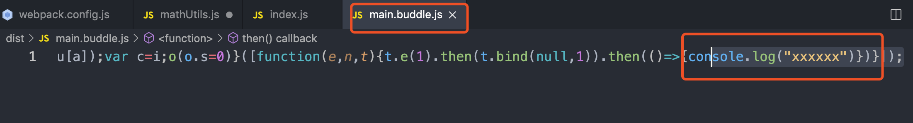
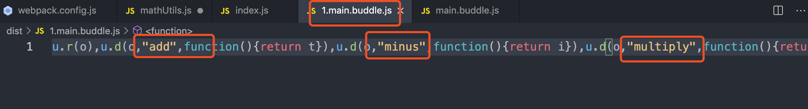
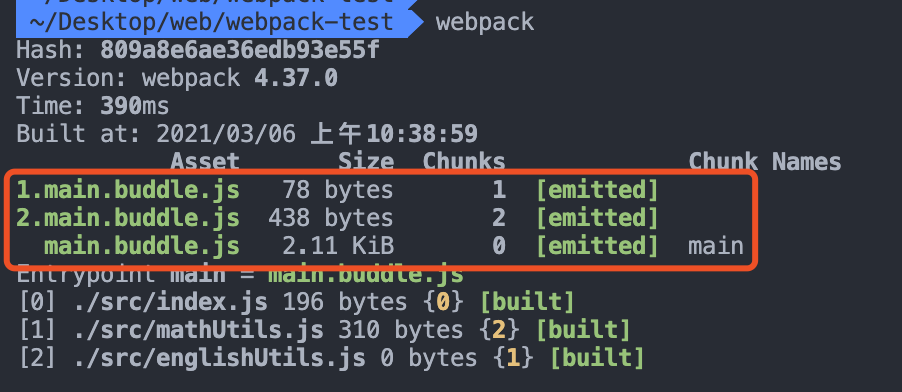

## 情景导入
```
我们来举个例子，下面是一个简单的 Javascript 文件，命名为 mathUtils.js，主要实现了基础的数学运算。
```

```js
export function add(a, b) {
    console.log("add");
    return a + b;
}

export function minus(a, b) {
    console.log("minus");
    return a - b;
}

export function multiply(a, b) {
    console.log("multiply");
    return a * b;
}

export function divide(a, b) {
    console.log("divide");
    return a / b;
}

```
```
在 index.js 里，我们通过如下方式调用该文件：
const { add } = require("./mathUtils");
add(1, 2);

那么问题出现了：
即使仅导入并使用了add()功能，我们也会看到文件中的所有功能都包含在最终输出中。
```



## 分析
```js
我们想要只把用到的add函数相关代码，打包进我们的文件。
要想做到这个的前提就是：编译时期就可以确定需要使用哪些模块，不需要使用哪些模块。

在ES6之前，模块管理主要是CommonJS，CommonJS的require是可以动态加载的。
这意味着我们可以根据代码中的条件导入新模块：
var myDynamicModule;
if (condition) {
    myDynamicModule = require("foo");
} else {
    myDynamicModule = require("bar");
} 
CommonJS 模块的这种 dynamic 性质意味着无法应用 Tree Shaking，
因为在实际运行代码之前无法确定需要哪些模块。

在ES6中，模块管理主要是Module，使用import语法，我们不再能够动态导入模块。
如下所示的代码是不被允许的：
if (condition) {
    import foo from "foo";
} else {
    import bar from "bar";
}
这种新语法还可以有效地 Tree Shaking，
因为可以确定导入后使用的任何代码，而无需先运行这些代码。
```

## 实现
```js
Tree Shaking 在 Webpack 中的实现，是用来尽可能的删除没有被使用过的代码，
一些被 import 了但其实没有被使用的代码。

我们只需将上面的代码简单修改，使用ES6的模块管理 import

import { add, multiply } from "./mathUtils";
add(1, 2);

在上面的示例中，multiply()函数从未使用过，将从最终的打包文件中删除。
Webpack默认支持Tree Shaking,不需要添加其他配置。
```



## import 动态加载模块
```js
这和我学习的不同呀，import是可以动态加载模块的呀

function test() {
    import("./mathUtils.js").then(() => {
        console.log('xxxxxx');
    });
}
test();

基于此，进行打包，会发现动态import的模块会单独打在一个chunk中
```



```js
为了验证 动态import的模块会单独打在一个chunk中，我们再添加一个文件

function test() {
    import("./mathUtils.js").then(() => {
        console.log('xxxxxx');
    });
    import("./englishUtils.js").then(() => {
        console.log('tttttttt');
    })
}
test();
```


```
打开相应buddle.js，发现里面包含所有函数，
所以动态 import 无法运用Tree Shaking。
```

## 副作用
```js
有一些代码，是在 import 时执行了一些行为，如添加一个全局变量。
这些行为不一定和任何导出相关，所以可能调用方并未使用导出的对象。
以至于Webpack认为不需要打包此模块。

解决方案：
要将某些文件标记为副作用，将它们添加到package.json文件中。
{
    ...,
    "sideEffects": [
        "./src/polyfill.js"
    ],
    ...,
}
```
